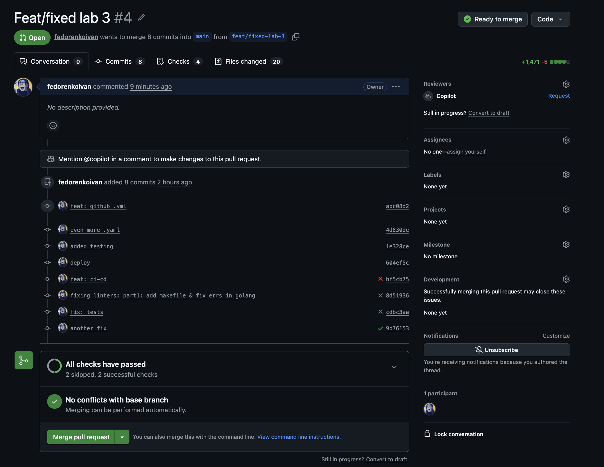
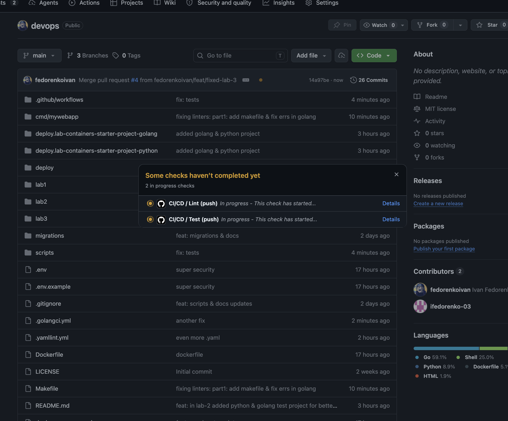
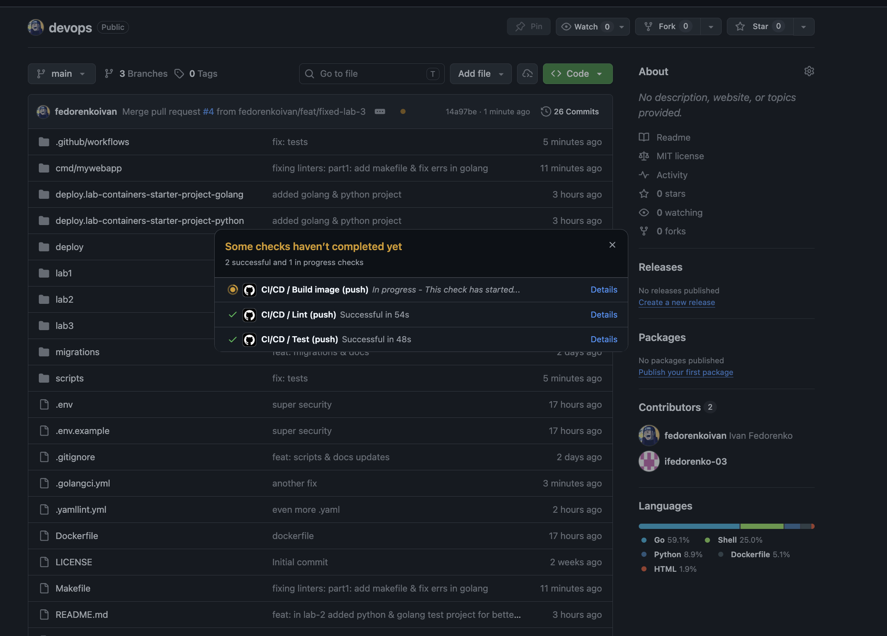
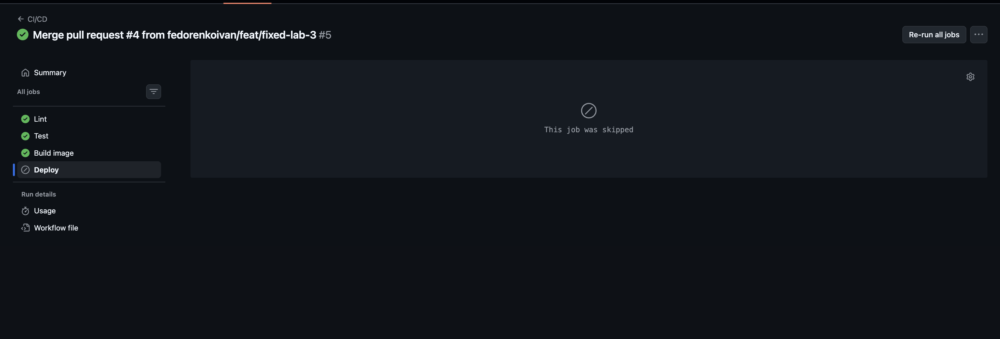
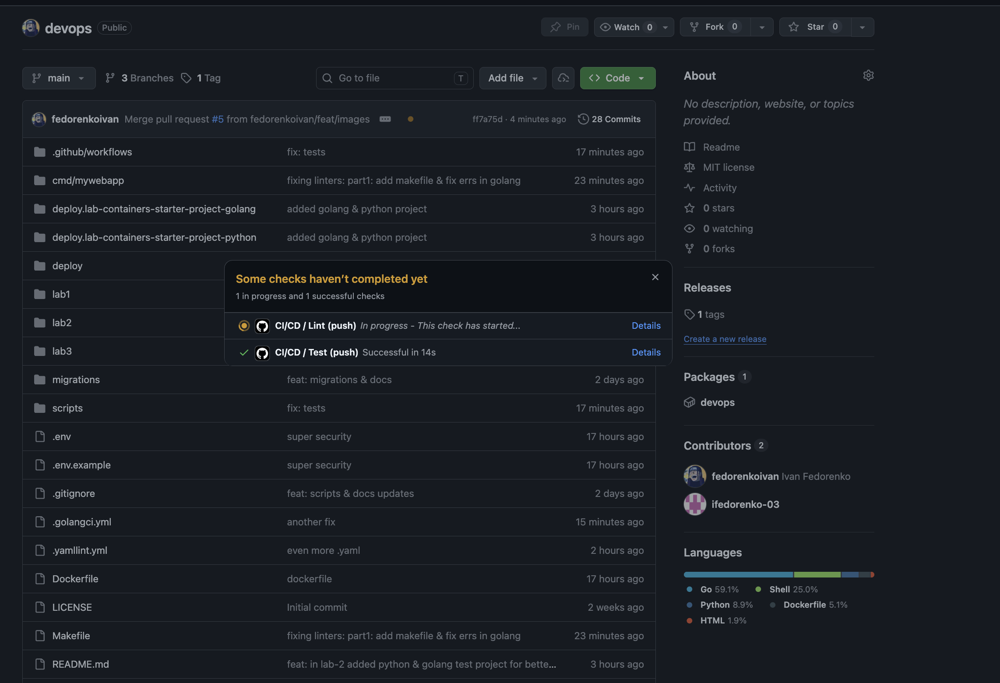
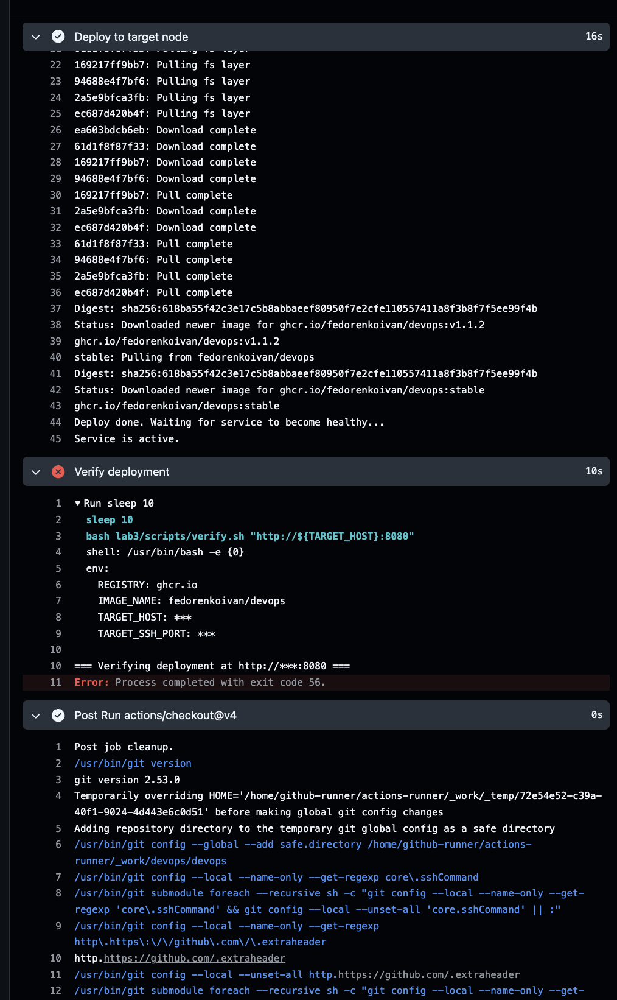
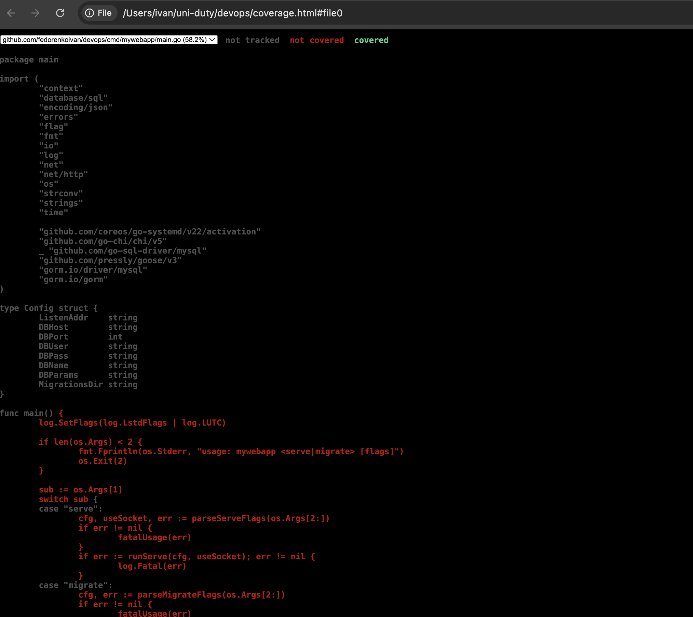
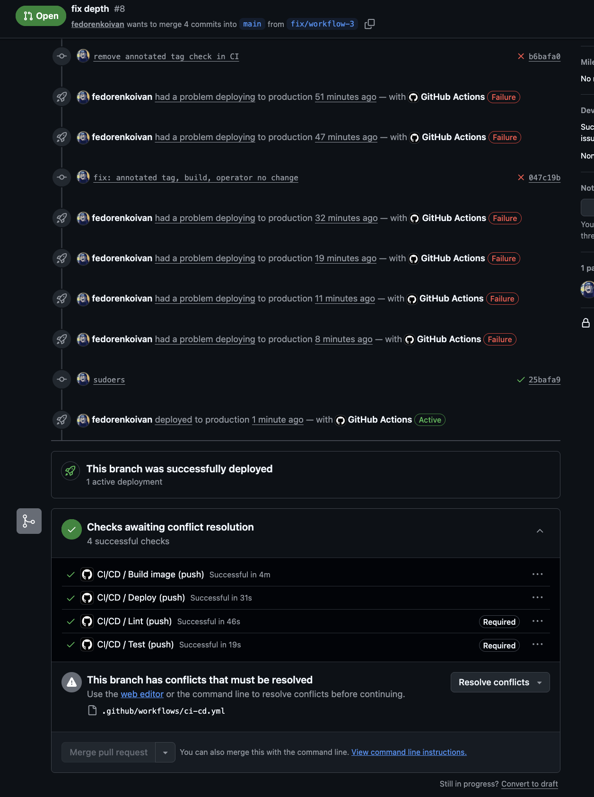

# Лабораторна робота №3 — CI/CD

## Зміст

1. [Огляд архітектури](#1-огляд-архітектури)
2. [Структура файлів](#2-структура-файлів)
3. [GitHub Actions pipeline](#3-github-actions-pipeline)
4. [Аналіз коду (linting)](#4-аналіз-коду-linting)
5. [Автоматичні тести](#5-автоматичні-тести)
6. [Збірка Docker-образу](#6-збірка-docker-образу)
7. [Підготовка self-hosted runner](#7-підготовка-self-hosted-runner)
8. [Підготовка target node](#8-підготовка-target-node)
9. [Розгортання](#9-розгортання)
10. [Верифікація](#10-верифікація)
11. [Branch protection rules](#11-branch-protection-rules)
12. [GitHub Secrets](#12-github-secrets)
13. [Workflow розгортання (end-to-end)](#13-workflow-розгортання-end-to-end)
14. [Демонстрація](#14-демонстрація)

---

## 1. Огляд архітектури

```
 Developer
     │  git push / PR / annotated tag
     ▼
 GitHub Actions (ubuntu-latest)
   ├── lint     — golangci-lint, hadolint, shellcheck, yamllint
   ├── test     — go test, coverage ≥ 40%, artifact upload
   └── build    — docker build + push to GHCR (linux/amd64 + linux/arm64)
                        │
                        │ (тільки annotated tag + build passed)
                        ▼
            self-hosted runner (Ubuntu 24.04, ARM64)
                 │  SSH (operator@target, port 2222)
                 ▼
            target node (Ubuntu 24.04, ARM64)
              docker pull ghcr.io/.../devops:stable
              systemctl restart mywebapp-container
                 │
                 ├── Docker container (--network=host :5200)
                 ├── nginx (proxy → 127.0.0.1:5200)
                 └── MariaDB (localhost:3306)
```

Після розгортання runner виконує `verify.sh`, який перевіряє HTTP-доступність сервісу.

---

## 2. Структура файлів

```
.github/workflows/
  ci-cd.yml               # єдиний pipeline: lint → test → build → deploy

cmd/mywebapp/
  main_test.go            # unit-тести (~60% coverage)

lab3/
  scripts/
    setup-runner.sh       # встановлення залежностей на runner VM
    setup-target.sh       # підготовка target node (Docker, nginx, MariaDB, systemd)
    deploy-app.sh         # розгортання образу на target node (запускається via SSH)
    verify.sh             # перевірка після розгортання
    run-runner.sh         # запуск runner VM (QEMU)
  systemd/
    mywebapp-container.service   # systemd unit для Docker-контейнера
  sudoers/
    operator              # NOPASSWD для systemctl mywebapp-container
  README_lab3.md

.golangci.yml             # конфіг golangci-lint v2
.yamllint.yml             # конфіг yamllint
Makefile                  # локальний запуск lint/test
```

Nginx-конфіг для lab3 — той самий `deploy/nginx/mywebapp.conf`, що й у lab1
(проксі на `127.0.0.1:5200`). Контейнер стартує з `--network=host`.

---

## 3. GitHub Actions pipeline

Файл: `.github/workflows/ci-cd.yml`

| Job | Runner | Тригер | Залежить від |
|-----|--------|--------|--------------|
| `lint` | ubuntu-latest | push main, tags, PR → main | — |
| `test` | ubuntu-latest | push main, tags, PR → main | — |
| `build` | ubuntu-latest | push (не PRи) | lint, test |
| `deploy` | self-hosted (ARM64) | annotated tags тільки | build |

### Теги образів

| Подія | Теги |
|-------|------|
| push до `main` | `latest`, `sha-<full-commit-sha>` |
| annotated tag | `stable`, `<tag>` |

### Перевірка annotated tag

`deploy` job перевіряє тип тегу через GitHub API перед розгортанням:
```bash
curl https://api.github.com/repos/.../git/refs/tags/<tag>
# object.type == "tag"  → annotated (deploy продовжується)
# object.type == "commit" → lightweight (deploy скасовується)
```

---

## 4. Аналіз коду (linting)

| Інструмент | Версія | Що перевіряє |
|-----------|--------|--------------|
| **golangci-lint** | v2.1 | Go-код (`govet`, `staticcheck`, `errcheck`, `ineffassign`, `gofmt`, `misspell`) |
| **hadolint** | v3.1.0 (action) | `Dockerfile` |
| **shellcheck** | системний | всі `*.sh`-файли в репозиторії |
| **yamllint** | pip | `.github/workflows/*.yml` |

Конфіги: `.golangci.yml`, `.yamllint.yml` у корені репозиторію.

Локальний запуск:
```bash
make lint        # всі лінтери
make lint-go     # тільки golangci-lint
make lint-docker # hadolint
make lint-shell  # shellcheck
make lint-yaml   # yamllint
```

---

## 5. Автоматичні тести

Файл: `cmd/mywebapp/main_test.go`

Тести написані для пакету `main`. Для тестування HTTP-хендлерів, що потребують БД,
використовується **in-memory SQLite** через `github.com/glebarez/sqlite` (pure-Go, без CGO).

Що покривається:
- `wantsHTML`, `htmlEscape`, `mysqlDSN` — чисті функції, всі гілки
- `parseServeFlags`, `parseMigrateFlags` — включно з error-кейсами
- `renderRootHTML` — HTTP-відповідь
- `writeJSON`, `decodeJSON` — включно з unknown-field rejection
- `listItems`, `createItem`, `getItem` — JSON та HTML-відповіді, всі error-шляхи

Поточне покриття: **~60%** (поріг: 40%).

Якщо покриття падає нижче 40% — `test` job завершується з помилкою і `build`/`deploy` не запускаються.

Артефакт `coverage-report` (`coverage.out`) завантажується при кожному push до `main`.

Локальний запуск:
```bash
make test        # запустити тести
make coverage    # тести + coverage.html звіт
```

---

## 6. Збірка Docker-образу

Образ будується з `Dockerfile` у корені репозиторію на `ubuntu-latest` runner.
Підтримуються платформи: **linux/amd64** та **linux/arm64** (через QEMU).
Публікується в **GitHub Container Registry** (`ghcr.io`).

Автентифікація в GHCR: `GITHUB_TOKEN` (автоматично доступний в Actions).

Після першого push пакет потрібно зробити **публічним**:
`GitHub → Packages → devops → Package settings → Change visibility → Public`

---

## 7. Підготовка self-hosted runner

### 7.1 Запуск VM

Окрема Ubuntu 24.04 Server VM (ARM64). У локальному середовищі (QEMU на Mac):

```bash
bash lab3/scripts/run-runner.sh
```

### 7.2 Встановлення залежностей

```bash
# На runner VM
git clone https://github.com/fedorenkoivan/devops.git
cd devops
sudo bash lab3/scripts/setup-runner.sh
```

Скрипт встановлює: Docker, Git, curl, ssh-client та завантажує бінарник GitHub Actions runner.

### 7.3 Реєстрація runner (вручну — токен НЕ зберігається в репо)

Токен отримати в: GitHub → Settings → Actions → Runners → **New self-hosted runner**

```bash
# На runner VM, від github-runner
sudo su - github-runner
cd ~/actions-runner
./config.sh \
  --url https://github.com/fedorenkoivan/devops \
  --token <REGISTRATION_TOKEN> \
  --unattended
```

### 7.4 Запуск runner

```bash
# Foreground (для лаби достатньо):
sudo su - github-runner
cd ~/actions-runner
./run.sh
```

Runner слухатиме jobs поки термінал відкритий.

### 7.5 SSH-доступ до target node

```bash
# На runner VM, від github-runner
sudo su - github-runner
ssh-keygen -t ed25519 -f ~/.ssh/deploy_key -N ""
cat ~/.ssh/deploy_key.pub   # скопіювати на target VM
```

На target VM:
```bash
sudo mkdir -p /home/operator/.ssh
echo "<deploy_key.pub>" | sudo tee /home/operator/.ssh/authorized_keys
sudo chmod 700 /home/operator/.ssh
sudo chmod 600 /home/operator/.ssh/authorized_keys
sudo chown -R operator:operator /home/operator/.ssh
sudo chage -d $(date +%Y-%m-%d) operator  # скинути примусову зміну пароля
```

Перевірка з runner VM:
```bash
sudo -u github-runner ssh -i /home/github-runner/.ssh/deploy_key \
  -p 2222 -o StrictHostKeyChecking=no operator@10.0.2.2 "echo OK"
```

### 7.6 Після завершення демонстрації

Зупиніть QEMU процес runner VM (Ctrl+C або закрийте термінал).
В GitHub Settings → Actions → Runners видаліть runner вручну.

---

## 8. Підготовка target node

### 8.1 Запуск VM

Ubuntu 24.04 Server (та сама VM що й у lab1, або нова). У локальному середовищі:

```bash
bash scripts/run-vm.sh
# SSH: localhost:2222 → VM:22
# nginx: localhost:8080 → VM:80
```

### 8.2 Клонування репо та запуск скрипта

```bash
git clone https://github.com/fedorenkoivan/devops.git
cd devops
sudo bash lab3/scripts/setup-target.sh
```

Що робить скрипт:
- Встановлює Docker, nginx, MariaDB
- Створює користувачів (`student`, `teacher`, `operator`)
- Конфігурує MariaDB (bind 127.0.0.1, БД `mywebapp`, юзер `mywebapp`)
- Створює `/etc/mywebapp/env` з конфігурацією застосунку
- Встановлює systemd unit `mywebapp-container.service`
- Встановлює nginx-конфіг та sudoers для `operator`

### 8.3 Env-файл `/etc/mywebapp/env`

```ini
DB_HOST=127.0.0.1
DB_PORT=3306
DB_USER=mywebapp
DB_PASS=mywebapp
DB_NAME=mywebapp
APP_PORT=5200
```

> Пароль БД — лише для локальної ізольованої VM. У реальному середовищі — GitHub Secrets.

---

## 9. Розгортання

Розгортання запускається автоматично при push **annotated тегу** після успішних lint, test і build.

### Як створити annotated tag

```bash
git tag -a v1.0.0 -m "Release v1.0.0"
git push origin v1.0.0
```

### Що відбувається в pipeline

1. `deploy` job запускається на self-hosted runner
2. Перевіряється тип тегу через GitHub API (annotated vs lightweight)
3. SSH на target node: `ssh -p 2222 operator@10.0.2.2`
4. На target node виконується `lab3/scripts/deploy-app.sh`:
   - `docker pull ghcr.io/fedorenkoivan/devops:<tag>`
   - `docker pull ghcr.io/fedorenkoivan/devops:stable`
   - `sudo systemctl restart mywebapp-container`
5. Runner виконує `lab3/scripts/verify.sh http://10.0.2.2:8080`

### systemd unit

`lab3/systemd/mywebapp-container.service`:

- Запускає контейнер з `--network=host` (доступ до MariaDB на localhost)
- `EnvironmentFile=/etc/mywebapp/env`
- Автоматично видаляє старий контейнер перед стартом (`ExecStartPre=-docker stop/rm`)
- `Restart=on-failure`
- **Без socket activation** (не вимагається в цій роботі)

---

## 10. Верифікація

Скрипт `lab3/scripts/verify.sh <base_url>` виконується на self-hosted runner після деплою.

| Перевірка | Очікуваний результат |
|-----------|---------------------|
| `GET /` | HTTP 200 |
| `GET /items` | HTTP 200 |
| `GET /health/alive` | HTTP 404 (nginx блокує згідно вимог lab1) |
| `GET /health/ready` | HTTP 404 (nginx блокує) |
| Content-Type `/items` | `application/json` |

При будь-якій помилці скрипт завершується з кодом 1 → job `deploy` падає.

---

## 11. Branch protection rules

Налаштовуються в GitHub → Settings → Branches → Add branch ruleset для `main`:

- [x] **Require status checks to pass before merging**
  - Required checks: `Lint`, `Test`
- [x] **Require branches to be up to date before merging**
- [x] **Do not allow bypassing the above settings**

Це гарантує, що PR не можна злити, якщо lint або тести не пройшли.

---

## 12. GitHub Secrets

Налаштовуються в Settings → Secrets and variables → Actions:

| Secret | Що містить |
|--------|-----------|
| `TARGET_HOST` | IP target node (у QEMU-сетапі: `10.0.2.2`) |
| `TARGET_SSH_PORT` | SSH порт target node (у QEMU-сетапі: `2222`) |
| `TARGET_SSH_KEY` | Приватний SSH-ключ (`/home/github-runner/.ssh/deploy_key`) |

`GITHUB_TOKEN` — вбудований, не потребує налаштування вручну.

---

## 13. Workflow розгортання (end-to-end)

```
git tag -a v1.0.0 -m "Release v1.0.0"
git push origin v1.0.0
         │
         ▼
[GitHub Actions — ubuntu-latest]
  lint  ──────────────────────────────────► OK
  test  ──► coverage.out artifact (main) ─► OK
  build ──► ghcr.io/.../devops:stable
         ──► ghcr.io/.../devops:v1.0.0
         (linux/amd64 + linux/arm64) ──────► OK
         │
         ▼
[GitHub Actions — self-hosted ARM64]
  deploy:
    verify annotated tag via GitHub API ──► OK
    ssh -p 2222 operator@10.0.2.2
      docker pull ghcr.io/.../devops:stable
      systemctl restart mywebapp-container
    verify.sh http://10.0.2.2:8080
      GET /             → 200 ✓
      GET /items        → 200 ✓
      GET /health/alive → 404 ✓
      GET /health/ready → 404 ✓
      Content-Type /items → application/json ✓
    ► DEPLOY SUCCESS
```

---

## 14. Демонстрація

### PR успішно злитий в main після проходження перевірок

Всі checks пройшли (Lint, Test) — кнопка Merge активна.



### PR заблокований — checks не пройшли

Lint впав → merge заблокований branch protection rules.


### Lint і Test запускаються на push до main



### Build image запускається після lint+test



### Deploy skipped на merge до main (не тег)

Lint ✓, Test ✓, Build ✓ — Deploy skipped, бо тригер не є annotated тегом.



### Checks запускаються після push annotated тегу



### Фейлена авторизація


### Test coverage




### Успішне розгортання на production

Всі jobs пройшли: Build ✓, Deploy ✓, Lint ✓, Test ✓.  
GitHub показує "This branch was successfully deployed".


